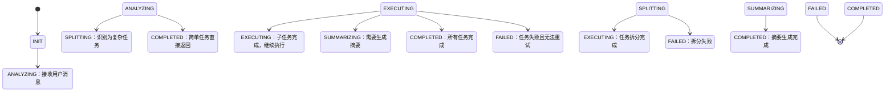
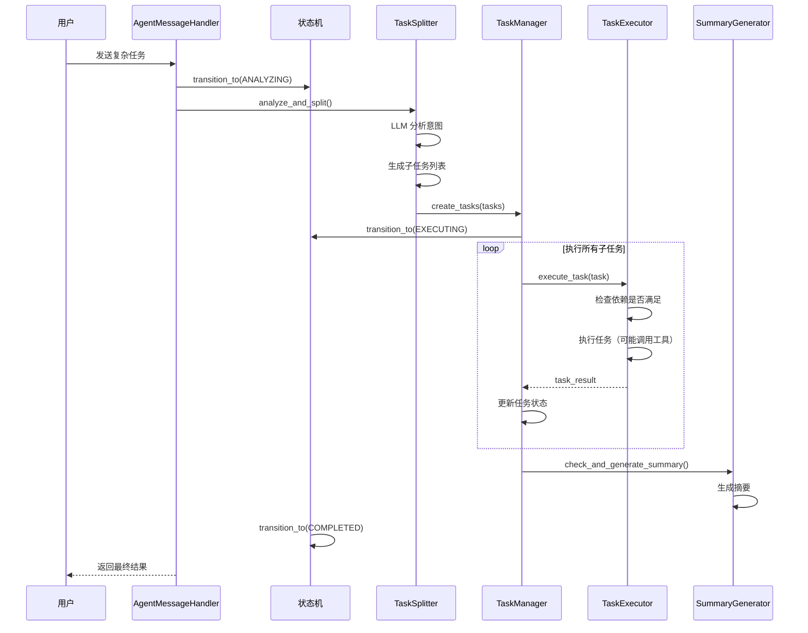
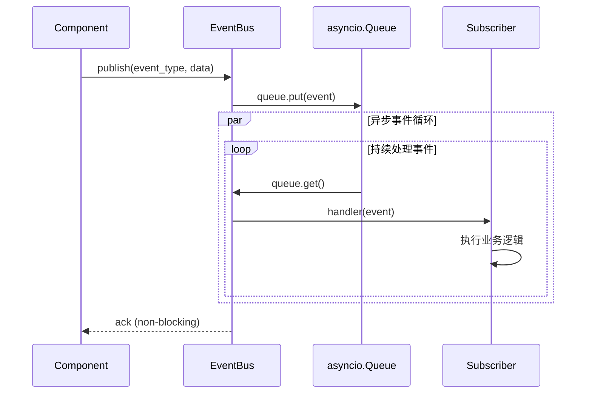

# Agent 工作流（Agent Workflow）

## 概述

Agent 工作流模块提供复杂任务的自动化编排能力，支持任务识别、拆分、依赖管理、并行执行等功能。该模块作为纯编排引擎，通过状态机和事件总线实现工作流的灵活管理，负责任务调度但不持久化任务状态（由 018-task-management 模块负责）。

### 模块职责边界

- **013-conversation**: 对话流程控制、聊天模式路由、消息接收/响应
- **014-agent-workflow**: 编排引擎（状态机 + 事件驱动调度）、任务拆分、依赖管理、并行调度
- **018-task-management**: 任务/工作流持久化、状态存储、执行追踪

## 功能需求

### 1. 复杂任务编排

**描述**：将复杂的用户任务分解为多个子任务，按照预设的工作流自动执行。

**功能**：
- **任务识别**：分析用户请求，识别是否需要复杂处理
- **任务拆分**：将复杂任务分解为可执行的子任务
- **任务依赖管理**：处理任务间的依赖关系
- **并行执行**：支持无依赖任务的并行执行

**场景示例**：
- 数据分析：先获取数据，再分析，最后生成报告
- 信息查询：查询多个数据源，汇总结果
- 多步骤操作：顺序执行一系列操作

**注意**：任务状态持久化由 018-task-management 模块负责，本模块仅负责任务编排逻辑。

### 2. 任务执行

**描述**：执行拆分后的子任务，包括工具调用、数据处理等。

**功能**：
- **任务调度**：调度子任务到执行队列
- **任务监控**：监控任务执行状态和进度
- **错误处理**：处理任务执行失败和重试
- **结果收集**：收集子任务的执行结果

**要求**：
- 支持任务的超时控制
- 支持任务的重试机制
- 支持任务的取消和回滚
- 记录详细的执行日志

### 3. 摘要生成

**描述**：当上下文 Token 不足或任务完成后，生成摘要来压缩上下文。

**功能**：
- **自动摘要**：根据配置自动生成对话摘要
- **摘要触发**：
  - Token 超过阈值时触发
  - 任务链完成时触发
  - 对话轮次达到阈值时触发
- **摘要存储**：保存摘要数据供后续使用
- **摘要恢复**：可根据摘要恢复上下文

**摘要策略**：
- 基于重要性提取
- 基于时间窗口
- 基于任务边界

### 4. 工具调用管理

**描述**：在工作流中调用各种工具，包括内置工具和用户工具。

**功能**：
- **工具注册**：注册可用的工具（内置工具和用户工具）
- **工具选择**：根据任务需求选择合适的工具
- **工具调用**：执行工具调用
- **工具结果处理**：处理工具返回结果

**工具类型**：
- 内置工具：RAG 检索、文件操作等
- 用户工具：用户自定义的工具
- MCP 工具：外部 MCP 服务器的工具

### 5. 工作流状态管理

**描述**：通过状态机管理工作流的状态转换。

**状态**：
- **INIT**：工作流初始化
- **ANALYZING**：分析用户请求
- **SPLITTING**：拆分任务
- **EXECUTING**：执行任务
- **SUMMARIZING**：生成摘要
- **COMPLETED**：工作流完成
- **FAILED**：工作流失败

**要求**：
- 状态转换必须有触发条件
- 支持状态的持久化（由 018-task-management 模块存储）
- 支持工作流的暂停和恢复
- 状态变更时发布事件到事件总线

### 6. 事件总线

**描述**：使用事件总线解耦工作流的各个组件，通过事件传递信息。

**事件类型**：
- 任务创建事件
- 任务完成事件
- 任务失败事件
- 工具调用事件
- 摘要生成事件
- 工作流状态变更事件

**要求**：
- 支持异步事件处理
- 支持事件订阅和取消
- 保证事件的可靠传递
- 支持事件优先级（HIGH、NORMAL、LOW）

## 技术约束

### 状态机实现
- 使用自定义轻量级状态机（基于 Python Enum + 状态转换表）
- 支持状态转换验证、状态持久化回调
- 不依赖外部库（如 transitions），保持轻量级
- 状态变更时立即通知 018-task-management 模块进行持久化

### 事件总线实现
- 内存事件总线：asyncio.Queue + 观察者模式
- 支持异步事件发布、非阻塞处理
- 事件类型强类型定义（Python Enum）
- 支持事件订阅/取消、批量处理
- 支持优先级队列（heapq 实现）

### 并发模型
- asyncio + ThreadPoolExecutor 混合模式
- CPU 密集型任务使用线程池（OCR、数据处理）
- IO 密集型任务使用 asyncio（工具调用、LLM 请求）
- 动态调整并发度（基于 CPU/内存水位）
- 最大并行任务数：CPU 核心数 * 2（可配置，默认 16）

## 性能要求

### 响应时间
- 任务拆分响应时间 < 1s
- 单个任务执行响应时间 < 10s（不包括长时间工具调用）
- 工作流完成时间 < 30s（不包括长时间工具调用）

### 并发能力
- 同时运行工作流数量 ≥ 1000
- 单个工作流最大并行任务数：CPU 核心数 * 2（可配置，默认 16）
- 工作流最大深度 ≤ 10 层（防止无限递归）
- 事件总线吞吐量 ≥ 5000 事件/秒

### 资源限制
- 单个工作流最大子任务数 ≤ 100
- 事件队列最大长度：10000（超过则丢弃低优先级事件）
- 线程池最大线程数：CPU 核心数 * 4（可配置）

## 安全要求

### 工具调用安全
- 工具调用权限验证（用户级 + 工作流级）
- 工具黑名单 + 白名单双控机制
- 工具调用链路审计（记录调用者、参数、结果、耗时）
- 防止无限递归/循环调用检测（基于调用栈分析）
- Prompt 泄露防护（工具参数脱敏处理）

### 结果安全
- 工具结果安全性过滤（XSS、SQL 注入检测）
- 敏感数据脱敏（PII、API Key、密码）
- 结果大小限制（防止内存溢出）

### 访问控制
- 工作流创建/取消/重试需验证用户权限
- 跨用户工作流访问拒绝（基于 user_id 隔离）

## 可靠性要求

### 状态持久化
- 工作流状态变更时立即持久化（每个任务状态）
- 支持工作流快照（整个工作流状态 + 任务列表）
- 持久化失败时重试 3 次，失败后降级到内存模式
- 持久化操作委托给 018-task-management 模块

### 重试策略
- 指数退避：1s, 2s, 4s, 8s, 16s
- 最大重试次数：5 次
- 重试触发条件：网络错误、临时性失败、工具超时
- 不支持重试：权限错误、参数错误、业务逻辑错误

### 补偿机制（Saga 模式）
- 长工作流失败时回滚已完成的任务
- 补偿操作记录到事件日志
- 支持手动触发补偿或自动补偿（可配置）
- 补偿操作委托给 018-task-management 模块协调

### 长任务处理
- 工具调用 > 30s 时启动进度上报（每 5s 一次）
- 用户可中断任意子任务（传播取消信号）
- 长任务超时自动取消（默认 300s，可配置）
- 进度信息通过事件总线发送

### 故障恢复
- 工作流支持断点续跑（从失败任务继续）
- 支持工作流重放（重新执行整个工作流）
- 系统崩溃后自动恢复活跃工作流（基于 018 模块的持久化状态）

## API 接口

### 1. 工作流管理 API

| 方法 | 路径 | 描述 | 请求体 | 响应体 |
|------|------|------|--------|--------|
| POST | `/api/v1/workflows` | 创建工作流 | `{"session_id": "...", "user_id": "...", "agent_id": "..."}` | `WorkflowDTO` |
| GET | `/api/v1/workflows/{workflow_id}` | 获取工作流详情 | N/A | `WorkflowDTO` |
| GET | `/api/v1/workflows` | 获取用户工作流列表 | `page`, `size`, `user_id` (查询参数) | `List[WorkflowDTO]` |
| GET | `/api/v1/sessions/{session_id}/workflows` | 获取会话工作流列表 | N/A | `List[WorkflowDTO]` |
| DELETE | `/api/v1/workflows/{workflow_id}` | 删除工作流 | N/A | `{"message": "..."}` |
| POST | `/api/v1/workflows/{workflow_id}/cancel` | 取消工作流 | `{"reason": "..."}` | `{"message": "..."}` |
| POST | `/api/v1/workflows/{workflow_id}/retry` | 重试工作流 | N/A | `WorkflowDTO` |
| POST | `/api/v1/workflows/{workflow_id}/replay` | 重放工作流 | N/A | `WorkflowDTO` |

### 2. 任务管理 API

| 方法 | 路径 | 描述 | 请求体 | 响应体 |
|------|------|------|--------|--------|
| GET | `/api/v1/workflows/{workflow_id}/tasks` | 获取工作流任务列表 | N/A | `List[TaskDTO]` |
| GET | `/api/v1/tasks/{task_id}` | 获取任务详情 | N/A | `TaskDTO` |
| GET | `/api/v1/tasks/{task_id}/status` | 获取任务状态 | N/A | `TaskStatusDTO` |
| POST | `/api/v1/tasks/{task_id}/retry` | 重试任务 | N/A | `TaskDTO` |
| POST | `/api/v1/tasks/{task_id}/cancel` | 取消任务 | N/A | `{"message": "..."}` |
| GET | `/api/v1/tasks/{task_id}/dependencies` | 获取任务依赖 | N/A | `List[TaskDTO]` |

### 3. 摘要管理 API

| 方法 | 路径 | 描述 | 请求体 | 响应体 |
|------|------|------|--------|--------|
| GET | `/api/v1/sessions/{session_id}/summaries` | 获取会话摘要 | N/A | `SummaryDTO` |
| GET | `/api/v1/workflows/{workflow_id}/summaries` | 获取工作流摘要 | N/A | `SummaryDTO` |
| POST | `/api/v1/sessions/{session_id}/summaries/regenerate` | 重新生成摘要 | `{"strategy": "..."}` | `SummaryDTO` |
| DELETE | `/api/v1/summaries/{summary_id}` | 删除摘要 | N/A | `{"message": "..."}` |
| GET | `/api/v1/summaries` | 获取用户摘要列表 | `user_id`, `page`, `size` (查询参数) | `List[SummaryDTO]` |

### 4. 工作流事件 API

| 方法 | 路径 | 描述 | 请求体 | 响应体 |
|------|------|------|--------|--------|
| GET | `/api/v1/workflows/{workflow_id}/events` | 获取工作流事件列表 | `limit` (查询参数) | `List[WorkflowEventDTO]` |
| GET | `/api/v1/events/types` | 获取事件类型统计 | N/A | `Dict[str, int]` |

## 附录：流程图

### 工作流状态机图

### 任务编排流程图

### 事件总线交互图

