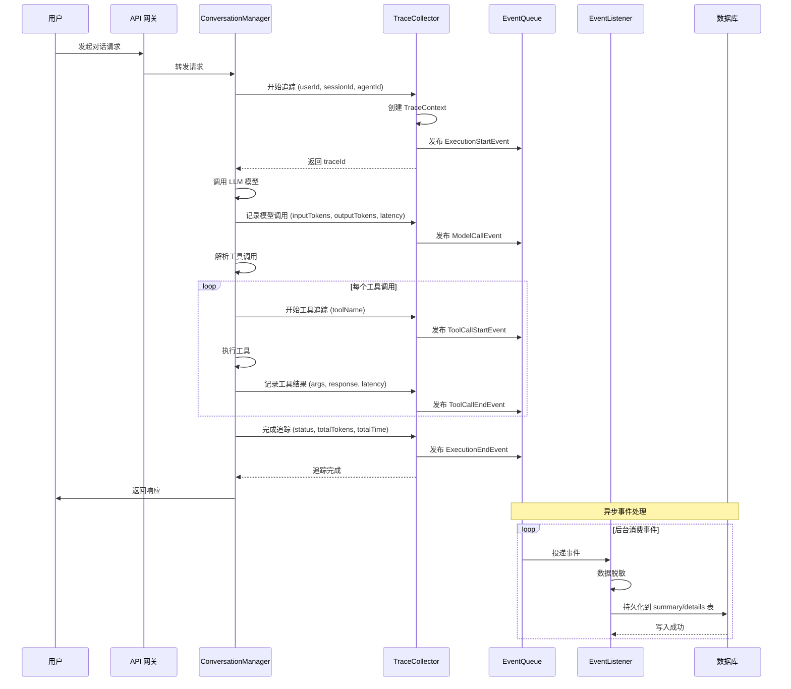

# 执行链路追踪能力 - 需求说明与场景描述

## 1. 概述

执行链路追踪能力是 AgentX 平台的核心可观测性能力，提供对 Agent 执行过程的完整追踪和监控。该能力记录 Agent 执行过程中的每个步骤，包括用户消息、AI 响应、模型调用、工具调用、降级处理等，帮助用户和管理员理解 Agent 的行为轨迹，定位问题和优化性能。

### 1.1 模块定位

- **核心作用**：为 Agent 执行提供全流程的可观测性和诊断能力
- **服务对象**：平台用户（查看自己的执行历史）、管理员（监控和分析）
- **应用场景**：问题排查、性能优化、行为分析、成本分析

### 1.2 核心价值

- **完整追踪**：记录从用户输入到 AI 响应的完整执行链路
- **性能监控**：记录每次调用的耗时、Token 使用量等性能指标
- **降级监控**：追踪模型降级情况，分析降级原因和频率
- **问题诊断**：通过详细记录帮助快速定位执行失败的原因
- **非侵入式**：采用事件驱动机制，追踪失败不影响主流程

---

## 1.4 安全与隐私保护

### 1.4.1 敏感数据脱敏

**自动脱敏规则**：
- **PII（个人身份信息）**：
  - 手机号：中间 4 位掩码（如 `138****5678`）
  - 邮箱：用户名部分掩码（如 `zha***@example.com`）
  - 身份证号：前后各保留 3 位，中间掩码
  - 银行卡号：仅保留后 4 位
- **认证信息**：
  - Token、API Key、密码：完全掩码（显示为 `***`）
  - Authorization Header：完全移除
- **自定义脱敏字段**：
  - 支持配置化脱敏规则（正则匹配）
  - 默认脱敏字段名包含：`token`, `password`, `secret`, `key`, `auth`

**脱敏实现方式**：
- 在数据采集层统一处理（TraceCollector）
- 脱敏规则可热更新，无需重启服务
- 开发环境可选择关闭脱敏（便于调试）

### 1.4.2 数据访问权限

**用户级隔离**：
- 普通用户：仅能查看自己的执行追踪数据
- 通过数据库行级安全策略强制过滤（RLS）
- API 查询时自动注入 `user_id = current_user_id` 条件

**管理员权限**：
- 平台管理员：可查看所有用户的执行数据
- 需要审计日志记录查询行为（谁、何时、查了谁）
- 支持批量分析（跨用户统计）

**Agent 维度权限**：
- Agent 创建者/管理者：可查看该 Agent 的所有执行记录
- 团队成员：根据团队权限配置查看

### 1.4.3 审计日志

**操作审计**：
- 记录所有追踪数据查询操作
- 审计字段：`query_user_id`, `query_target_user_id`, `query_time`, `query_condition`, `result_count`
- 审计日志保留期：2 年

**异常访问检测**：
- 检测到频繁查询不同用户数据的行为
- 检测到大批量数据导出行为
- 触发告警并通知安全管理员

### 1.4.4 数据加密

**传输加密**：
- 所有 API 使用 HTTPS
- 内部服务调用使用 mTLS（可选）

**存储加密**：
- 数据库启用 TDE（透明数据加密）
- 敏感字段（如工具调用参数）应用层加密存储
- Redis 缓存启用加密（可选）

---

## 1.5 技术约束与性能要求

### 1.3.1 技术选型

**存储方案**：
- **短期方案**：PostgreSQL（宽表设计）+ Redis（热点数据缓存）
  - PostgreSQL 用于持久化存储执行汇总和详细数据
  - Redis 用于缓存最近 24 小时的活跃会话追踪数据
- **长期方案**：ClickHouse（大规模分析）+ Jaeger/Zipkin（分布式追踪）
  - ClickHouse 用于海量追踪数据的聚合分析
  - Jaeger/Zipkin 用于 OpenTelemetry 兼容的分布式追踪

**采集方式**：
- AOP 装饰器 + 异步队列上报
- 使用 Python asyncio.Queue 作为缓冲队列
- 后台消费者异步持久化到存储

**核心组件**：
- TraceContext：追踪上下文，包含追踪 ID、用户 ID、会话 ID、Agent ID 等信息
- TraceCollector：追踪数据收集器，负责记录执行过程中的各种事件
- EventPublisher：事件发布器，基于 asyncio.Queue 实现
- TraceEventListener：事件监听器，异步处理事件并持久化数据
- DataMasker：数据脱敏工具，处理敏感数据

### 1.3.2 性能指标

**埋点延迟要求**：
- 同步埋点延迟：< 5ms（P99）
- 异步上报阻塞时间：< 1ms
- 追踪系统不能显著影响主路径性能

**存储吞吐要求**：
- 写入吞吐：> 10,000 traces/s
- 查询响应：P95 < 500ms（百万级数据量）
- 并发查询：支持 100+ QPS

**可用性要求**：
- 追踪系统可用性：> 99.9%
- 数据完整性：> 99.99%（允许极少数丢失）
- 故障恢复时间：< 5 分钟

### 1.3.3 数据粒度与存储策略

**数据保留周期**：
- **执行详细数据**：90 天（可配置）
  - 包含完整的输入输出、Token 详情、工具调用参数
  - 大模型输出超过 10KB 时自动截断并标记
- **执行汇总数据**：1 年（可配置）
  - 仅保留统计指标，不包含详细内容
- **归档数据**：永久（可选）
  - 压缩存储到冷存储（S3/GCS）

**存储成本控制**：
- 单条追踪详细数据上限：100KB
- 超过上限自动截断并标记 `is_truncated=true`
- 大字段（如长文本输出）单独存储引用

**采样策略**：
- **开发环境**：100% 全量采集
- **生产环境**：
  - 默认采样率：10%
  - 按 Trace ID 哈希采样（保证同一会话完整）
  - 错误/失败请求：100% 采集
  - VIP 用户：100% 采集
  - 可配置白名单（特定用户/Agent 全量）

**数据压缩**：
- 工具调用参数和响应使用 gzip 压缩
- 压缩率目标：60%-80%
- 查询时透明解压

---

## 1.6 分析维度与统计指标

### 1.6.1 Token 统计维度

**按 Agent 维度**：
- 每个 Agent 的总 Token 消耗
- 输入 Token vs 输出 Token 比例
- Token 消耗趋势（日/周/月）

**按模型维度**：
- 各模型提供商的 Token 分布
- 各模型端点的 Token 消耗
- 单位 Token 成本分析

**按工具类型维度**：
- 不同类型工具调用的 Token 消耗
- 工具调用频率与 Token 效率
- 高 Token 消耗工具 TOP10

**按时间维度**：
- 小时级 Token 消耗热力图
- 工作日 vs 周末对比
- 月度 Token 预算执行率

### 1.6.2 性能统计维度

**按 Agent 维度**：
- 平均执行耗时
- P95/P99 延迟
- 执行成功率

**按工具类型维度**：
- 各类工具的平均调用耗时
- 工具调用失败率排名
- 工具性能瓶颈分析

**按失败原因分类**：
- 模型超时次数及占比
- 工具调用失败次数及占比
- 网络错误次数及占比
- 配额不足次数及占比

### 1.6.3 降级分析维度

**降级原因枚举**：

| 降级原因代码 | 描述 | 触发条件 |
|------------|------|----------|
| `MODEL_TIMEOUT` | 模型请求超时 | 连续 N 次请求超过设定超时时间 |
| `HIGH_ERROR_RATE` | 错误率过高 | 最近 M 分钟内错误率超过阈值 |
| `MODEL_UNAVAILABLE` | 模型不可用 | 模型服务返回 5xx 错误或连接拒绝 |
| `QUOTA_EXHAUSTED` | 配额耗尽 | API Quota 或 Token 余额不足 |
| `RATE_LIMITED` | 触发限流 | 达到 QPS/RPM限制 |
| `HEALTH_CHECK_FAILED` | 健康检查失败 | 主动健康检查探测失败 |
| `MANUAL_SWITCH` | 手动切换 | 管理员手动触发降级 |
| `CIRCUIT_BREAKER` | 熔断触发 | 熔断器打开状态 |

**降级统计指标**：
- 总降级次数
- 各降级原因的分布
- 平均降级持续时间
- 频繁降级的模型 TOP10
- 降级前后的性能对比（耗时、成功率）

**降级分析视图**：
- 降级时间线：展示降级事件的时间分布
- 降级桑基图：展示降级流向（从哪个模型降到哪个模型）
- 降级影响评估：估算降级导致的额外成本和延迟

---

## 1.7 典型链路示例

### 1.7.1 执行链路时序图



### 1.7.2 执行汇总数据示例（JSON）

```json
{
  "traceId": "trace_20260314_abc123",
  "userId": "user_789",
  "sessionId": "session_456",
  "agentId": "agent_001",
  "executionStartTime": "2026-03-14T10:30:00Z",
  "executionEndTime": "2026-03-14T10:30:05.234Z",
  "totalExecutionTime": 5234,
  "totalInputTokens": 1200,
  "totalOutputTokens": 800,
  "totalTokens": 2000,
  "toolCallCount": 3,
  "totalToolExecutionTime": 1500,
  "executionSuccess": true,
  "errorPhase": null,
  "errorMessage": null,
  "isFallbackUsed": false,
  "fallbackReason": null,
  "metadata": {
    "modelEndpoint": "gpt-4-turbo",
    "providerName": "openai",
    "samplingRate": 0.1,
    "isSampled": true
  }
}
```

### 1.7.3 执行详细步骤示例（JSON）

```json
{
  "traceId": "trace_20260314_abc123",
  "steps": [
    {
      "stepId": "step_001",
      "timestamp": "2026-03-14T10:30:00.100Z",
      "messageType": "USER_MESSAGE",
      "messageContent": "帮我查询北京的天气",
      "messageTokens": 50,
      "userId": "user_789"
    },
    {
      "stepId": "step_002",
      "timestamp": "2026-03-14T10:30:01.500Z",
      "messageType": "MODEL_CALL",
      "modelEndpoint": "gpt-4-turbo",
      "providerName": "openai",
      "inputTokens": 1200,
      "outputTokens": 150,
      "totalTokens": 1350,
      "modelCallTime": 1400,
      "aiResponse": "我将为您查询北京的天气..."
    },
    {
      "stepId": "step_003",
      "timestamp": "2026-03-14T10:30:02.000Z",
      "messageType": "TOOL_CALL",
      "toolName": "weather_query",
      "toolRequestArgs": "{\"city\": \"北京\", \"date\": \"2026-03-14\"}",
      "toolResponseData": "{\"temperature\": 15, \"condition\": \"晴\"}",
      "toolExecutionTime": 500,
      "toolSuccess": true,
      "isFallbackUsed": false
    },
    {
      "stepId": "step_004",
      "timestamp": "2026-03-14T10:30:03.500Z",
      "messageType": "MODEL_CALL",
      "modelEndpoint": "gpt-4-turbo",
      "providerName": "openai",
      "inputTokens": 1350,
      "outputTokens": 650,
      "totalTokens": 2000,
      "modelCallTime": 1500,
      "aiResponse": "北京今天天气晴朗，温度 15°C..."
    },
    {
      "stepId": "step_005",
      "timestamp": "2026-03-14T10:30:05.234Z",
      "messageType": "AI_RESPONSE",
      "messageContent": "北京今天天气晴朗，温度 15°C，适宜外出。",
      "messageTokens": 800,
      "userId": "user_789"
    }
  ]
}
```

### 1.7.4 降级场景示例（JSON）

```json
{
  "traceId": "trace_20260314_def456",
  "isFallbackUsed": true,
  "fallbackReason": "MODEL_TIMEOUT",
  "fallbackFromEndpoint": "gpt-4-turbo",
  "fallbackToEndpoint": "gpt-3.5-turbo",
  "fallbackTimestamp": "2026-03-14T11:20:00Z",
  "fallbackDetails": {
    "originalModelLatency": 30000,
    "fallbackModelLatency": 2000,
    "timeoutThreshold": 25000,
    "consecutiveTimeouts": 3
  }
}
```

---

## 2. 核心能力

### 2.1 Agent 执行追踪

Agent 执行追踪是整个能力的核心，记录每次 Agent 执行的完整信息。

#### 功能描述

- **执行启动追踪**：在 Agent 开始执行时创建追踪上下文
- **执行过程记录**：记录执行过程中的所有关键步骤
- **执行完成汇总**：在执行结束时生成汇总统计数据

#### 关键数据

**AgentExecutionSummaryEntity（执行汇总信息）**

- `userId`：用户 ID
- `sessionId`：会话 ID
- `agentId`：Agent ID
- `executionStartTime`：执行开始时间
- `executionEndTime`：执行结束时间
- `totalExecutionTime`：总执行时间（毫秒）
- `totalInputTokens`：总输入 Token 数
- `totalOutputTokens`：总输出 Token 数
- `totalTokens`：总 Token 数
- `toolCallCount`：工具调用总次数
- `totalToolExecutionTime`：工具执行总耗时
- `executionSuccess`：执行是否成功
- `errorPhase`：错误发生阶段
- `errorMessage`：错误信息

**AgentExecutionDetailEntity（执行详细步骤）**

- `sessionId`：关联的会话 ID
- `messageContent`：统一的消息内容
- `messageType`：消息类型（USER_MESSAGE、AI_RESPONSE、TOOL_CALL）
- `modelEndpoint`：使用的模型部署名称
- `providerName`：提供商名称
- `messageTokens`：消息 Token 数
- `modelCallTime`：模型调用耗时
- `toolName`：工具名称
- `toolRequestArgs`：工具调用入参（JSON 格式）
- `toolResponseData`：工具调用出参（JSON 格式）
- `toolExecutionTime`：工具执行耗时
- `toolSuccess`：工具执行是否成功
- `isFallbackUsed`：是否触发了降级
- `fallbackReason`：降级原因
- `fallbackFromEndpoint`：降级前的模型部署名称
- `fallbackToEndpoint`：降级后的模型部署名称

---

### 2.2 工具调用记录

工具调用记录追踪 Agent 执行过程中对工具的调用情况。

#### 功能描述

- **工具调用追踪**：记录每次工具调用的入参、出参和执行结果
- **执行时间记录**：记录工具执行的耗时
- **结果缓存**：保存工具调用的完整结果用于后续分析

#### 工具调用信息

- 工具名称
- 调用时间戳
- 入参（JSON 格式）
- 出参（JSON 格式）
- 执行耗时（毫秒）
- 执行状态（成功/失败）
- 错误信息（如果失败）

---

### 2.3 模型调用记录

模型调用记录追踪 Agent 对 LLM 模型的调用情况。

#### 功能描述

- **模型调用追踪**：记录每次模型调用的详细信息
- **Token 使用统计**：记录输入和输出的 Token 数量
- **性能监控**：记录模型调用的响应时间

#### 模型调用信息

- 模型部署名称（模型端点）
- 提供商名称
- 调用时间戳
- 输入 Token 数
- 输出 Token 数
- 总 Token 数
- 模型调用耗时（毫秒）

---

### 2.4 降级监控

降级监控追踪模型降级情况，用于分析和优化系统稳定性。

#### 功能描述

- **降级触发记录**：记录每次触发降级的情况
- **降级原因分析**：记录降级的具体原因
- **降级前后对比**：记录降级前后的模型变更

#### 降级信息

- 是否触发降级
- 降级原因（请求超时、错误率高、模型不可用等）
- 降级前模型部署名称
- 降级后模型部署名称
- 降级发生时间

---

### 2.5 链路查询与统计

提供强大的查询和统计能力，帮助用户和管理员分析执行数据。

#### 功能描述

- **执行历史查询**：按时间范围查询用户的执行历史
- **会话追踪查询**：查询特定会话的执行链路
- **执行统计**：提供执行成功率、平均耗时等统计指标
- **失败记录查询**：查询失败的执行记录用于问题分析

#### 查询能力

- **执行详情查询**：根据追踪 ID 查询完整的执行链路
- **执行历史分页查询**：分页查询用户的执行历史
- **会话执行历史查询**：查询特定会话的所有执行记录
- **时间范围查询**：查询指定时间段内的执行记录
- **失败执行查询**：查询所有失败的执行记录
- **执行统计查询**：查询用户的执行统计信息（总次数、成功率、平均耗时等）
- **工具调用查询**：查询特定追踪中的工具调用记录
- **模型调用查询**：查询特定追踪中的模型调用记录

---

## 3. 核心场景

### 3.1 用户查询执行历史

用户查看自己的 Agent 执行历史，了解 Agent 的使用情况和效果。

**场景描述**：

1. 用户进入执行历史页面
2. 系统展示按时间倒序的执行列表
3. 用户点击某条记录查看详细执行链路
4. 详细页面展示完整的执行步骤，包括：
   - 用户消息
   - AI 响应
   - 工具调用详情
   - 模型调用信息
   - 降级情况（如果有）
   - 错误信息（如果有）

**关键业务规则**：

- 用户只能查询自己的执行历史
- 支持分页查询，默认每页 15 条
- 支持按时间范围过滤

### 3.2 问题排查

当 Agent 执行失败或结果不符合预期时，使用追踪数据进行问题排查。

**场景描述**：

1. 用户报告 Agent 执行异常
2. 管理员通过查询失败的执行记录定位问题
3. 查看详细的执行链路，关注：
   - 错误发生阶段
   - 错误信息
   - 工具调用失败情况
   - 模型调用异常
   - 降级记录

**关键业务规则**：

- 失败的执行记录会高亮错误步骤
- 提供完整的错误堆栈信息（如果有）
- 记录错误发生的具体时间

### 3.3 性能优化分析

通过分析执行追踪数据，优化 Agent 的性能表现。

**场景描述**：

1. 管理员查询执行统计信息
2. 分析平均执行时间、Token 使用量等指标
3. 识别性能瓶颈：
   - 工具调用耗时过长
   - 模型调用响应慢
   - Token 使用量异常
4. 针对问题进行优化

**关键业务规则**：

- 提供完整的统计数据
- 支持按 Agent 维度对比性能
- 支持按时间趋势分析性能变化

### 3.4 成本分析

通过 Token 使用统计进行成本分析。

**场景描述**：

1. 管理员查询执行统计中的 Token 使用数据
2. 分析各 Agent、各模型的 Token 消耗
3. 计算成本并进行预算管理
4. 识别高成本使用模式

**关键业务规则**：

- 统计总输入 Token、总输出 Token、总 Token
- 支持按时间范围统计
- 支持按 Agent 维度统计

### 3.5 降级分析

分析模型降级情况，优化系统稳定性。

**场景描述**：

1. 管理员查询降级记录
2. 分析降级频率和原因
3. 识别经常降级的模型
4. 采取相应措施（增加稳定性、调整降级策略等）

**关键业务规则**：

- 记录降级原因
- 记录降级前后的模型
- 支持按时间范围