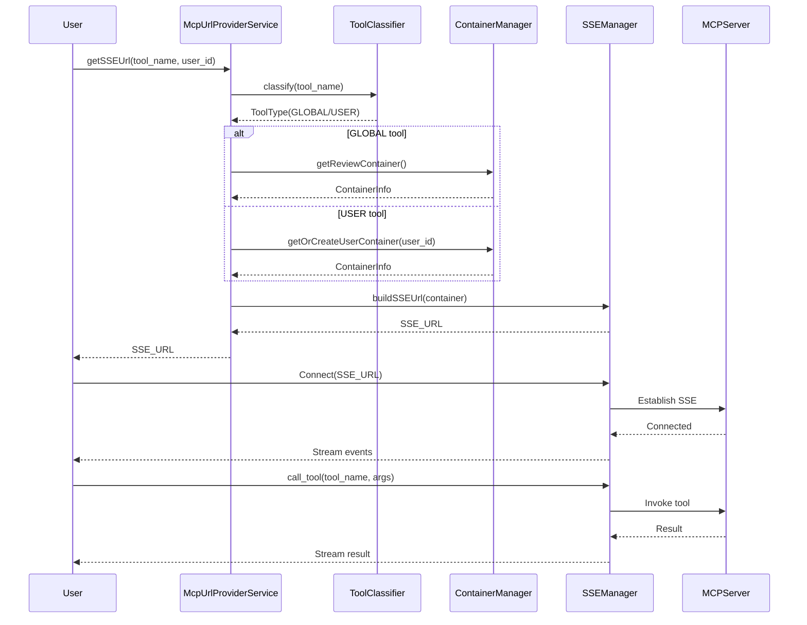

# MCP 支持（MCP Support）

## 概述

MCP 支持模块提供对 MCP（Model Context Protocol）协议的支持，包括 MCP 服务器 URL 管理、工具参数预设、容器化工具服务等功能。

## 功能需求

### 1. MCP 协议支持

**描述**：支持 MCP 协议标准，实现与 MCP 服务器的互操作。

**功能**：
- **协议适配**：适配 MCP 协议标准
- **工具发现**：从 MCP 服务器发现可用工具
- **工具调用**：按照 MCP 协议调用工具
- **事件处理**：处理 MCP 协议的事件和流

**要求**：
- 遵循 MCP 协议规范
- 支持多版本 MCP 协议
- 提供标准的错误处理和异常转换

### 2. MCP 服务器 URL 管理

**描述**：管理 MCP 服务器的 URL，为工具调用提供连接地址。

**功能**：
- **URL 获取**：根据工具名称获取对应的 MCP 服务器 URL
- **URL 智能判断**：自动判断工具类型并选择连接策略
- **URL 构建**：构建完整的服务器连接 URL
- **URL 验证**：验证 URL 的合法性和可达性

**连接类型**：
- **全局工具**：使用审核容器
- **用户工具**：使用用户专用容器
- **直接连接**：直接连接到外部 MCP 服务器

### 3. 工具类型判断

**描述**：自动判断工具类型（全局工具或用户工具），选择合适的容器和连接策略。

**判断逻辑**：
- **工具名称匹配**：根据工具名称查询工具信息
- **标记判断**：根据工具的 isGlobal 标记判断类型
- **容错处理**：无法判断时默认为用户工具

### 4. 容器集成

**描述**：与容器管理模块集成，为 MCP 工具提供容器化运行环境。

**功能**：
- **容器自动创建**：工具需要时自动创建并启动容器
- **容器状态检查**：检查容器运行状态
- **容器 URL 构建**：基于容器信息构建 SSE 连接 URL
- **容器自动清理**：容器不再使用时自动清理

**容器类型**：
- **审核容器**：用于全局工具的审核环境
- **用户容器**：用于用户工具的专用环境
- **临时容器**：一次性使用的临时容器

### 5. 工具参数预设

**描述**：支持工具参数的预设，简化用户调用。

**功能**：
- **参数定义**：定义工具的参数及其默认值
- **参数模板**：提供参数模板供用户选择
- **参数验证**：验证参数的类型和范围
- **参数序列化**：将参数序列化为 MCP 协议格式

**要求**：
- 参数定义采用标准格式（如 JSON Schema）
- 支持参数的类型校验
- 支持参数的提示和描述

### 6. SSE 连接管理

**描述**：使用 Server-Sent Events (SSE) 建立与 MCP 服务器的实时连接。

**功能**：
- **SSE URL 构建**：构建标准的 SSE 连接 URL
- **连接建立**：建立到 MCP 服务器的 SSE 连接
- **事件接收**：接收 MCP 协议的事件
- **连接维护**：维护连接状态和心跳

**事件类型**：
- 工具列表事件
- 工具调用事件
- 结果返回事件
- 错误和状态事件

## 技术约束

- 遵循 MCP 协议规范
- 与容器管理模块深度集成
- 支持分布式部署和负载均衡
- 使用 SSE 实现实时通信

### MCP 协议版本

**支持的版本**:
- MCP 协议 1.0 (基础版本)
- MCP 协议 2.0 (增强版本，支持流式响应和批量工具调用)
- 自定义 MCP 协议 (通过适配器模式扩展)

**实现方式**:
- HTTP 客户端：使用 `httpx` 库 (异步模式)
- SSE 客户端：基于 `httpx-sse` 封装自定义客户端
- 策略模式：不同协议版本使用独立的适配器类

### SSE 连接参数

**连接管理**:
- 心跳间隔：30 秒
- 连接超时：10 秒
- 空闲超时：300 秒 (自动断开无活动的连接)
- 最大并发连接数：100 个 SSE 连接/服务器实例

**重连策略**:
- 重试次数：最多 5 次
- 退避算法：指数退避 (基础延迟 1s, 最大延迟 30s)
  - 第 1 次重试：1s
  - 第 2 次重试：2s
  - 第 3 次重试：4s
  - 第 4 次重试：8s
  - 第 5 次重试：16s

## 性能要求

- MCP 工具 URL 获取响应 < 100ms
- SSE 连接建立时间 < 1s
- 容器启动时间 < 30s
- 工具调用响应时间 < 5s（不包括容器启动）
- 并发连接数：≤100 个 SSE 连接/服务器实例
- 容器资源配额：CPU ≤2 核，内存 ≤4GB/容器
- 动态扩缩容：基于工具调用频率阈值 (10 次/分钟) 自动调整容器数量
- 缓存命中率：≥80% (工具定义和 URL 缓存)
- 连接池大小：10-50 个连接/服务器

## 安全要求

- MCP 服务器访问权限控制
- 验证容器和 URL 的合法性
- 支持 HTTPS 连接
- 防止容器逃逸和资源滥用

### 容器网络隔离

**网络配置**:
- 禁止使用 `--network=host` 模式
- 使用 bridge 网络 + 端口映射
- 容器间通信仅允许通过 Docker 网络
- 每个用户容器运行在独立的网络命名空间

### SSE 认证机制

**JWT Token 认证**:
- Token 通过 URL 查询参数传递：`?token=<jwt_token>`
- 重连时刷新 token (短效 token，TTL 15 分钟)
- 用户登出时吊销 token
- 支持 token 续期 (活跃连接自动刷新)

### 参数安全

**验证与加密**:
- 使用 JSON Schema / Pydantic 模型进行参数验证
- 敏感参数值加密存储 (AES-256)
- 日志中脱敏处理 (密钥、密码等敏感信息)
- 严格的类型校验和范围检查

### 容器安全防护

**防逃逸措施**:
- 只读文件系统 (read-only rootfs)
- 禁止特权模式 (no privileged mode)
- 丢弃危险 capabilities (CAP_SYS_ADMIN, CAP_NET_ADMIN 等)
- 限制系统调用 (seccomp profile)
- 资源限制 (cgroups)

## 可靠性要求

- SSE 连接断开自动重连
- 容器失败时自动恢复
- 支持容器状态持久化和恢复
- 保证工具调用的幂等性

### 重试策略

**重试机制**:
- 最大重试次数：3 次
- 指数退避间隔：1s, 2s, 4s
- 仅针对瞬时错误 (网络抖动、超时)
- 永久性错误 (参数错误、工具不存在) 不重试

### 状态持久化

**存储方案**:
- 容器状态 → PostgreSQL (`mcp_connections` 表)
- 活跃连接缓存 → Redis (TTL 5 分钟)
- 定期同步内存状态到数据库 (每 30 秒)

### 幂等性保证

**实现机制**:
- 工具调用包含幂等性键 (UUID)
- 5 分钟窗口内去重
- Redis 记录已处理的幂等性键 (TTL 5 分钟)
- 相同键的请求直接返回首次执行结果

## 扩展性要求

- 支持新增 MCP 协议版本
- 支持自定义容器模板
- 支持工具的动态注册
- 支持多种连接策略

### 协议版本适配器接口

**抽象基类**: `MCPProtocolAdapter`

```python
class MCPProtocolAdapter(ABC):
    @abstractmethod
    async def connect(self, server_url: str) -> Connection:
        """建立与 MCP 服务器的连接"""
        pass
    
    @abstractmethod
    async def discover_tools(self) -> List[ToolDefinition]:
        """发现可用工具列表"""
        pass
    
    @abstractmethod
    async def call_tool(self, tool_name: str, args: dict) -> ToolResult:
        """调用指定工具"""
        pass
    
    @abstractmethod
    async def disconnect(self):
        """断开连接并清理资源"""
        pass
```

**版本注册**:
- 配置文件中注册支持的协议版本
- 通过依赖注入选择对应适配器
- 运行时根据服务器协议版本自动切换

### 容器模板注册机制

**模板格式** (JSON Schema):
```json
{
  "name": "string",
  "dockerfile_path": "string",
  "env_vars": {"key": "value"},
  "ports": [8080, 8443],
  "resource_limits": {
    "cpu": "2.0",
    "memory": "4GB"
  },
  "validation_schema": {}
}
```

**注册流程**:
- 模板验证 (符合 JSON Schema)
- 存储到 `container_templates` 表
- 支持热加载 (无需重启服务)

## 典型交互示例

### MCP 调用时序图



### 工具发现响应示例

**请求**:
```http
GET /api/v1/mcp/tools?server_id=xxx
```

**响应**:
```json
{
  "tools": [
    {
      "name": "web_search",
      "description": "Search the web for real-time information",
      "inputSchema": {
        "type": "object",
        "properties": {
          "query": {
            "type": "string",
            "description": "Search query"
          },
          "limit": {
            "type": "integer",
            "minimum": 1,
            "maximum": 50,
            "default": 10,
            "description": "Maximum number of results"
          }
        },
        "required": ["query"]
      },
      "outputSchema": {
        "type": "array",
        "items": {
          "type": "object",
          "properties": {
            "title": {"type": "string"},
            "url": {"type": "string"},
            "snippet": {"type": "string"}
          }
        }
      }
    },
    {
      "name": "code_executor",
      "description": "Execute Python code in a sandboxed environment",
      "inputSchema": {
        "type": "object",
        "properties": {
          "code": {
            "type": "string",
            "description": "Python code to execute"
          },
          "timeout": {
            "type": "integer",
            "minimum": 1,
            "maximum": 60,
            "default": 30,
            "description": "Execution timeout in seconds"
          }
        },
        "required": ["code"]
      }
    }
  ]
}
```
